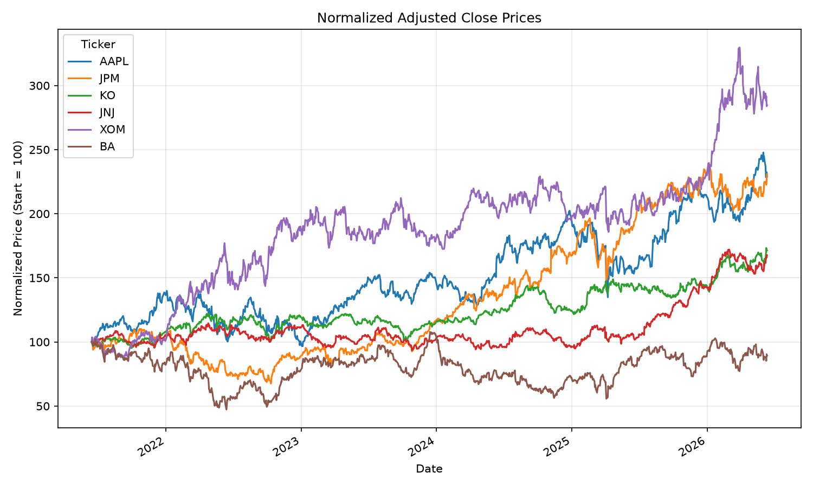
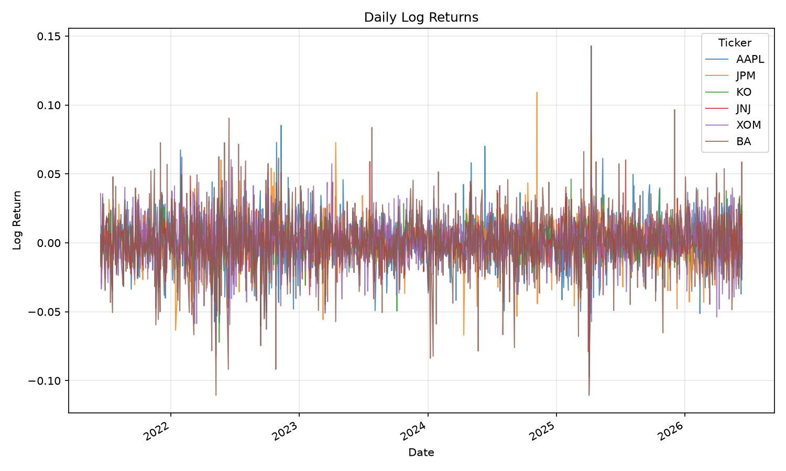
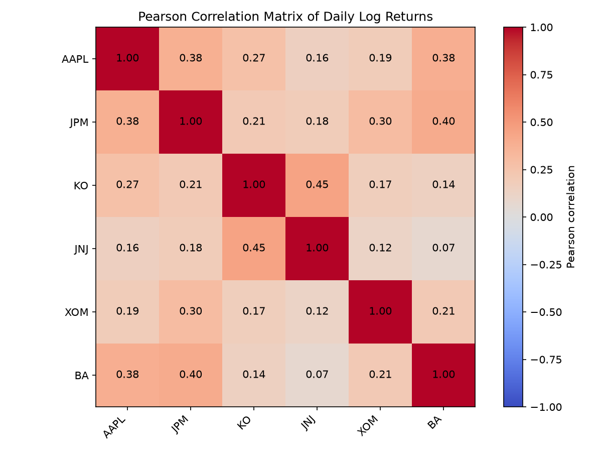
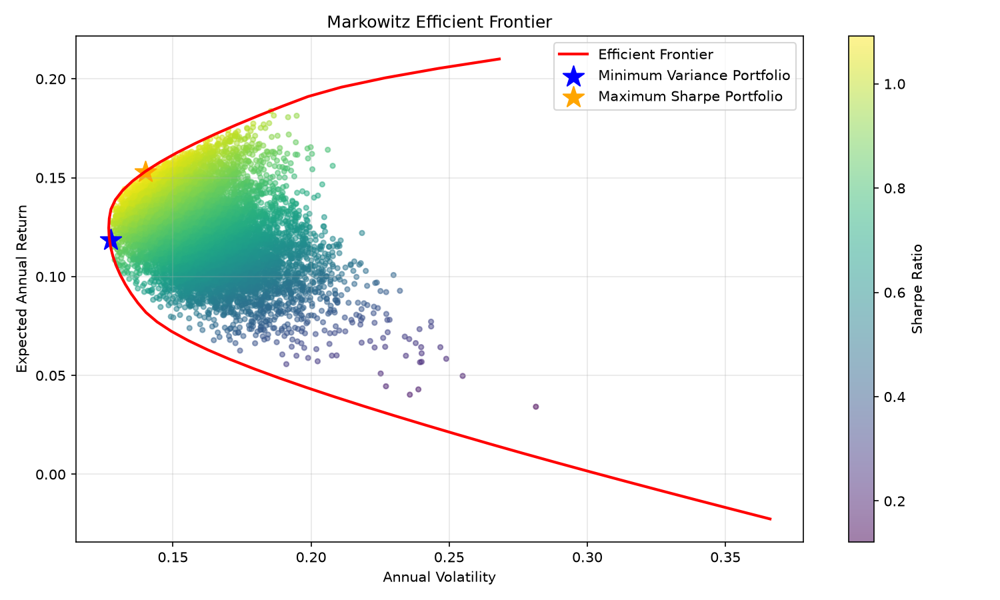

# 1. Introduzione

La costruzione di portafoglio costituisce un problema centrale nella finanza, poiché gli investitori raramente valutano i titoli in modo isolato. Essi allocano invece il capitale tra più attività finanziarie al fine di perseguire un obiettivo di investimento, controllando al contempo l'esposizione all'incertezza. Un portafoglio correttamente strutturato offre un criterio sistematico per determinare la quota di ricchezza da destinare a ciascuna attività, evitando di fondare la decisione esclusivamente sulle caratteristiche dei singoli titoli o su valutazioni informali.

Un aspetto essenziale della scelta di portafoglio è il trade-off tra rischio e rendimento. In generale, gli investitori richiedono rendimenti attesi più elevati come compensazione per l'assunzione di una maggiore incertezza sui risultati futuri. Le attività più rischiose possono offrire opportunità di guadagno superiori, ma espongono anche a perdite potenziali più ampie e a una maggiore volatilità della performance. L'analisi di portafoglio richiede pertanto sia una stima del rendimento atteso sia una misura del rischio, così da consentire un confronto coerente tra allocazioni alternative.

La diversificazione svolge un ruolo rilevante nella gestione di tale relazione. Combinando attività i cui rendimenti non si muovono in perfetta sincronia, l'investitore può ridurre il rischio complessivo del portafoglio senza necessariamente diminuire il rendimento atteso nella stessa proporzione. Il beneficio della diversificazione dipende non solo dalla rischiosità delle singole attività, ma anche dalla covarianza e dalla correlazione tra i loro rendimenti. Di conseguenza, la costruzione di portafoglio deve considerare sia le interazioni tra i titoli sia le rispettive prospettive di rendimento atteso.

L'obiettivo di questo progetto è analizzare sei azioni appartenenti a settori differenti e costruire portafogli efficienti mediante il modello media-varianza di Markowitz. Il lavoro applica la teoria di portafoglio a un insieme diversificato di titoli azionari, stima le caratteristiche di rendimento e rischio sulla base di dati storici e fornisce il fondamento teorico per individuare portafogli che presentino combinazioni efficienti di rendimento atteso e rischio.

# 2. Richiami teorici

Gli investimenti rischiosi sono attività i cui rendimenti futuri risultano incerti. Le azioni ordinarie sono rischiose perché prezzi e dividendi possono variare in risposta a fattori specifici dell'impresa, condizioni settoriali, variabili macroeconomiche, tassi di interesse, aspettative degli investitori e dinamiche generali di mercato. Poiché il payoff futuro non è noto con certezza, gli investitori devono valutare sia la remunerazione attesa derivante dal possesso dell'attività sia la variabilità dei possibili risultati rispetto a tale aspettativa.

La relazione tra rischio e rendimento rappresenta uno dei principi fondamentali delle decisioni finanziarie. Gli investitori si attendono generalmente rendimenti più elevati quando sopportano livelli di rischio maggiori. Tuttavia, un rischio più alto non garantisce rendimenti realizzati superiori; esso indica soltanto una maggiore incertezza e un intervallo più ampio di esiti possibili. Per questa ragione, l'analisi di portafoglio distingue tra rendimento atteso, che esprime il risultato medio previsto, e rischio, comunemente misurato tramite la varianza o la deviazione standard dei rendimenti.

L'avversione al rischio descrive la preferenza della maggior parte degli investitori a evitare rischi non necessari. Un investitore avverso al rischio sceglierà, tra due investimenti con lo stesso rendimento atteso, quello meno rischioso. Al contrario, accetterà un rischio aggiuntivo solo se il rendimento atteso risulterà sufficientemente più elevato da compensarlo. Questa ipotesi è centrale nell'analisi media-varianza, poiché spiega perché gli investitori ricercano portafogli che minimizzino il rischio per un dato rendimento atteso oppure massimizzino il rendimento atteso per un dato livello di rischio.

L'analisi media-varianza valuta i portafogli mediante due grandezze principali: rendimento atteso e varianza. Il rendimento atteso rappresenta il rendimento medio che l'investitore prevede di ottenere dal portafoglio, mentre la varianza misura la dispersione dei rendimenti attorno a tale valore atteso. In questo quadro, l'investitore confronta i portafogli in base al rendimento atteso e al rischio, assumendo che tali dimensioni sintetizzino in modo efficace la performance dell'investimento.

La diversificazione consiste nell'allocare la ricchezza tra più attività, anziché concentrare l'intero investimento in un solo titolo. Il suo obiettivo è ridurre l'esposizione al rischio specifico delle singole attività. Quando le attività non sono perfettamente correlate positivamente, perdite o rendimenti deboli di un titolo possono essere parzialmente compensati da risultati migliori di un altro. Pertanto, il rischio di un portafoglio diversificato dipende sia dalla volatilità delle singole attività sia dalle relazioni tra i loro rendimenti.

Il rendimento atteso di un portafoglio è la media ponderata dei rendimenti attesi delle attività incluse nel portafoglio. Se un portafoglio contiene \(n\) attività, dove \(w_i\) è il peso assegnato all'attività \(i\) ed \(E(R_i)\) è il rendimento atteso dell'attività \(i\), il rendimento atteso del portafoglio è:

$$
E(R_p) = \sum_{i=1}^{n} w_i E(R_i)
$$

La varianza di portafoglio misura il rischio del portafoglio complessivo. A differenza del rendimento atteso, essa non corrisponde soltanto a una media ponderata delle varianze delle singole attività, ma dipende anche dalle covarianze tra i rendimenti. La covarianza misura la tendenza di due attività a muoversi congiuntamente. Una covarianza positiva indica che le attività tendono spesso a muoversi nella stessa direzione, mentre una covarianza negativa segnala movimenti frequentemente opposti. Una covarianza più bassa tra attività accresce il potenziale beneficio della diversificazione.

Utilizzando la notazione matriciale, la varianza di portafoglio può essere espressa come:

$$
\sigma_p^2 = w^T \Sigma w
$$

dove \(w\) è il vettore dei pesi di portafoglio e \(\Sigma\) è la matrice di covarianza dei rendimenti delle attività. Tale espressione evidenzia che il rischio di portafoglio dipende dall'intera struttura di covarianza delle attività, e non soltanto dal rischio di ciascun titolo considerato separatamente.

In un portafoglio interamente investito, la somma dei pesi deve essere pari a uno. Questa condizione assicura che tutto il capitale disponibile sia allocato tra le attività selezionate:

$$
\sum_{i=1}^{n} w_i = 1
$$

La frontiera efficiente è l'insieme dei portafogli che offrono il rendimento atteso più elevato per ciascun livello di rischio oppure, in modo equivalente, il rischio più basso per ciascun livello di rendimento atteso. I portafogli collocati al di sotto della frontiera efficiente sono inefficienti, poiché esiste un altro portafoglio ammissibile che offre un rendimento atteso maggiore a parità di rischio oppure un rischio inferiore a parità di rendimento atteso. La frontiera efficiente costituisce quindi una rappresentazione visiva e analitica delle migliori combinazioni rischio-rendimento ottenibili dato un insieme di attività.

La teoria di portafoglio di Markowitz, sviluppata da Harry Markowitz, formalizza la selezione di portafoglio attraverso il paradigma media-varianza. Essa sottolinea che gli investitori non dovrebbero selezionare le attività esclusivamente sulla base dei rendimenti attesi o dei rischi individuali. Al contrario, dovrebbero valutare il modo in cui le attività interagiscono all'interno del portafoglio tramite la covarianza. Combinando rendimenti attesi, varianze, covarianze e vincoli sui pesi di portafoglio, il modello di Markowitz individua portafogli efficienti e fornisce una base rigorosa per la moderna costruzione di portafoglio.

Sulla base di questi richiami teorici, l'analisi empirica applica il modello di Markowitz a sei azioni statunitensi appartenenti a settori differenti. I rendimenti storici saranno utilizzati per stimare i rendimenti attesi e la matrice di covarianza; tali stime costituiranno quindi l'input per la costruzione della frontiera efficiente, del portafoglio a minima varianza e del portafoglio con massimo Sharpe Ratio.

# 3. Raccolta dati

La base informativa utilizzata per l'analisi è costituita da dati storici di mercato provenienti da Yahoo Finance, una fonte ampiamente impiegata nelle applicazioni empiriche di finanza per l'accesso a serie temporali di prezzi azionari. I dati sono stati raccolti con frequenza giornaliera, in modo da osservare con sufficiente dettaglio la dinamica dei prezzi e dei rendimenti nel tempo. L'orizzonte temporale complessivo considerato copre approssimativamente gli ultimi cinque anni, dal 22 giugno 2021 al 22 giugno 2026. Al fine di rendere più rigorosa la valutazione empirica, il mese più recente è stato escluso dal campione utilizzato per la stima: il campione di training comprende il periodo dal 22 giugno 2021 al 29 maggio 2026, mentre il campione di test comprende esclusivamente il periodo dal 1 giugno 2026 al 22 giugno 2026. In questo modo, rendimenti attesi, matrice di covarianza, correlazioni e pesi dei portafogli ottimali sono stimati soltanto sui dati disponibili nel campione di training, mentre l'ultimo mese viene impiegato unicamente per una verifica fuori campione della performance realizzata. Tale separazione tra periodo di stima e periodo di valutazione evita l'introduzione di look-ahead bias, poiché le informazioni del mese finale non contribuiscono alla costruzione dei portafogli.

Operativamente, la raccolta e la preparazione dei dati sono state effettuate nello script `src/01_download_data.py`, che interroga Yahoo Finance tramite la libreria `yfinance` con frequenza giornaliera e `auto_adjust=False`, così da poter estrarre esplicitamente la colonna `Adj Close`. Dopo il download congiunto dei sei ticker, le serie vengono riordinate secondo una sequenza fissa e vengono eliminate le date con osservazioni incomplete, in modo che tutti i titoli presentino lo stesso calendario di rendimenti confrontabili. Lo stesso script salva sia il campione completo sia la separazione tra training e test, mantenendo inoltre i percorsi storici `data/raw/adjusted_close_prices.csv` e `data/processed/log_returns.csv` puntati al training set utilizzato nelle successive elaborazioni.

Il campione è composto da sei titoli azionari quotati sul mercato statunitense: Apple (AAPL), JPMorgan Chase (JPM), Coca-Cola (KO), Johnson & Johnson (JNJ), Exxon Mobil (XOM) e Boeing (BA). La selezione di tali società risponde all'esigenza di costruire un insieme di attività rappresentativo di settori economici differenti. Apple appartiene al comparto tecnologico, JPMorgan Chase al settore finanziario, Coca-Cola ai beni di consumo difensivi, Johnson & Johnson al settore sanitario, Exxon Mobil all'energia e Boeing all'industria aerospaziale e manifatturiera. Tale eterogeneità settoriale è rilevante perché riduce la concentrazione dell'analisi su un'unica area dell'economia e permette di valutare in modo più appropriato i potenziali benefici della diversificazione.

Per ciascun titolo sono stati utilizzati i prezzi di chiusura rettificati, indicati come *Adjusted Close*. Questa variabile incorpora gli effetti di eventi societari quali dividendi, frazionamenti azionari e altre rettifiche rilevanti, fornendo pertanto una misura più coerente del rendimento effettivamente conseguibile dall'investitore rispetto al semplice prezzo di chiusura non rettificato. L'impiego dei prezzi rettificati è particolarmente importante quando si analizzano serie storiche su un orizzonte pluriennale, poiché consente di evitare distorsioni nella misurazione della performance.

A partire dai prezzi rettificati sono stati calcolati i rendimenti logaritmici giornalieri. Se \(P_t\) rappresenta il prezzo rettificato del titolo al tempo \(t\) e \(P_{t-1}\) il prezzo rettificato nel giorno di negoziazione precedente, il rendimento logaritmico è definito come:

$$
r_t = \ln\left(\frac{P_t}{P_{t-1}}\right)
$$

I rendimenti logaritmici sono preferiti in molte applicazioni finanziarie perché risultano additivi nel tempo e facilitano l'aggregazione dei rendimenti su orizzonti temporali più lunghi. Inoltre, per variazioni di prezzo contenute, essi sono molto vicini ai rendimenti semplici, ma presentano proprietà analitiche più convenienti nell'ambito della modellizzazione statistica e dell'analisi di portafoglio.

Coerentemente con questa impostazione, tutte le statistiche descrittive successive sono calcolate sui rendimenti logaritmici giornalieri del solo training set, come previsto dallo script `src/02_descriptive_analysis.py`. Tale scelta garantisce che media, deviazione standard, minimi, massimi, skewness e kurtosis sintetizzino esclusivamente l'informazione disponibile nella fase di stima, mentre il mese finale rimane riservato alla verifica fuori campione.

# 4. Analisi descrittiva

L'analisi descrittiva costituisce una fase preliminare essenziale nello studio dei dati finanziari, poiché consente di sintetizzare le principali caratteristiche empiriche dei rendimenti prima dell'applicazione di modelli più strutturati di selezione di portafoglio. Le statistiche descrittive permettono di valutare il livello medio dei rendimenti, la dispersione attorno alla media, l'ampiezza degli estremi osservati e la forma della distribuzione. In questo modo è possibile individuare differenze rilevanti tra i titoli in termini di performance storica, volatilità e rischio di eventi estremi.

Nella Figura 1 i prezzi sono normalizzati ponendo pari a 100 il valore iniziale di ciascuna serie. Questa trasformazione non modifica la dinamica relativa dei titoli, ma elimina l'effetto dei diversi livelli assoluti di prezzo e rende quindi confrontabili società con quotazioni iniziali molto differenti.

*Figura 1. Andamento dei prezzi normalizzati dei titoli analizzati, utile per confrontare l'evoluzione relativa delle quotazioni nel periodo osservato su una base comune pari a 100.*

## 4.1 Statistiche descrittive dei rendimenti

| Titolo | Media | Deviazione Standard | Minimo | Massimo | Skewness | Kurtosis |
|---------|---------|---------|---------|---------|---------|---------|
| AAPL | 0.000703 | 0.017276 | -0.097013 | 0.142617 | 0.248562 | 5.971457 |
| JPM | 0.000658 | 0.015378 | -0.077787 | 0.109254 | -0.049936 | 4.720601 |
| KO | 0.000413 | 0.010108 | -0.072168 | 0.046168 | -0.269165 | 3.871000 |
| JNJ | 0.000372 | 0.010613 | -0.078953 | 0.060090 | -0.010907 | 5.034804 |
| XOM | 0.000813 | 0.016823 | -0.082136 | 0.062142 | -0.316088 | 1.492777 |
| BA | -0.000043 | 0.023039 | -0.110608 | 0.143010 | -0.150880 | 3.490003 |

La tabella delle statistiche descrittive va letta come una sintesi congiunta di rendimento medio, rischio e forma distributiva dei rendimenti logaritmici giornalieri. La media indica la direzione della performance storica media, la deviazione standard misura la volatilità giornaliera, minimo e massimo segnalano gli shock estremi osservati, mentre skewness e kurtosis aiutano a valutare asimmetria e peso delle code. Le statistiche riportate evidenziano una significativa eterogeneità tra i rendimenti giornalieri dei sei titoli. In termini di rendimento medio, Exxon Mobil presenta il valore più elevato, pari a 0.000834, segnalando la performance media giornaliera più favorevole nel campione considerato. Anche JPMorgan Chase e Apple mostrano rendimenti medi positivi e relativamente elevati, rispettivamente pari a 0.000667 e 0.000660. Coca-Cola e Johnson & Johnson registrano rendimenti medi più contenuti, ma comunque positivi, coerentemente con la natura più difensiva dei rispettivi settori. Boeing, al contrario, presenta un rendimento medio negativo, pari a -0.000090, indicando che nel periodo osservato il titolo ha avuto una performance media giornaliera inferiore rispetto agli altri strumenti analizzati.

La deviazione standard consente di confrontare il grado di volatilità dei rendimenti. Boeing risulta il titolo più volatile, con una deviazione standard pari a 0.023065, segnalando una maggiore instabilità dei rendimenti giornalieri e una più ampia esposizione al rischio specifico. Apple, Exxon Mobil e JPMorgan Chase mostrano livelli di volatilità intermedi, mentre Coca-Cola e Johnson & Johnson presentano le deviazioni standard più basse, rispettivamente pari a 0.010202 e 0.010623. Tale evidenza è coerente con il profilo difensivo dei beni di consumo essenziali e del settore sanitario, che tendono a essere meno sensibili alle oscillazioni cicliche rispetto a comparti più esposti alla congiuntura economica.

I valori minimi e massimi confermano la presenza di oscillazioni giornaliere rilevanti, soprattutto per i titoli caratterizzati da maggiore rischiosità. Boeing mostra sia un minimo molto negativo, pari a -0.110608, sia un massimo elevato, pari a 0.143010, indicando una distribuzione dei rendimenti particolarmente ampia. Anche Apple evidenzia un massimo molto elevato, pari a 0.142617, accompagnato da una volatilità superiore a quella dei titoli difensivi. Exxon Mobil, pur registrando il rendimento medio più alto, presenta una volatilità significativa, ma inferiore a quella di Boeing; ciò suggerisce una performance storica relativamente forte, sebbene accompagnata da un'esposizione non trascurabile al rischio del settore energetico.

La skewness fornisce informazioni sull'asimmetria della distribuzione dei rendimenti. Apple presenta una skewness positiva, indicando una maggiore probabilità relativa di osservare rendimenti estremamente positivi rispetto a rendimenti estremamente negativi. Gli altri titoli mostrano valori negativi o prossimi allo zero. JPMorgan Chase e Johnson & Johnson presentano asimmetrie molto contenute, suggerendo distribuzioni quasi simmetriche. Coca-Cola, Exxon Mobil e Boeing registrano invece skewness negative, che possono essere interpretate come una maggiore incidenza relativa di osservazioni estreme nella coda sinistra della distribuzione, cioè di perdite giornaliere particolarmente marcate.

La kurtosis misura il grado di concentrazione della distribuzione e la rilevanza delle code rispetto a una distribuzione normale. I valori positivi e relativamente elevati osservati per Apple, Johnson & Johnson e JPMorgan Chase indicano distribuzioni leptocurtiche, caratterizzate da code più pesanti e quindi da una maggiore probabilità di rendimenti estremi. Anche Coca-Cola e Boeing presentano valori di kurtosis superiori a zero, confermando che gli eventi estremi non sono trascurabili. Exxon Mobil mostra una kurtosis più contenuta rispetto agli altri titoli, pur mantenendo una distribuzione non perfettamente assimilabile a quella normale.

Nel complesso, i risultati descrittivi hanno implicazioni rilevanti per la costruzione del portafoglio. I titoli con rendimenti medi più elevati, come Exxon Mobil, JPMorgan Chase e Apple, possono contribuire all'incremento del rendimento atteso del portafoglio, ma devono essere valutati congiuntamente alla loro volatilità e alla forma della distribuzione dei rendimenti. I titoli più difensivi, come Coca-Cola e Johnson & Johnson, pur offrendo rendimenti medi inferiori, possono contribuire alla stabilizzazione del portafoglio grazie alla minore volatilità. Boeing, data la combinazione di rendimento medio negativo e volatilità elevata, richiede particolare attenzione nella fase di allocazione, poiché potrebbe aumentare il rischio complessivo senza offrire un adeguato contributo al rendimento atteso. Queste evidenze confermano l'importanza di combinare attività con caratteristiche differenti, affinché la selezione di portafoglio tenga conto non solo della performance media, ma anche della variabilità, dell'asimmetria e della probabilità di eventi estremi.

Le serie dei rendimenti logaritmici giornalieri mostrate nella Figura 2 permettono di osservare direttamente gli shock giornalieri, cioè variazioni improvvise e di ampiezza rilevante rispetto alla normale oscillazione dei titoli. La concentrazione di movimenti ampi in determinati intervalli temporali segnala inoltre la volatilità dei rendimenti e la possibile presenza di cluster di volatilità, nei quali giornate turbolente tendono a essere seguite da altre giornate caratterizzate da forte instabilità.

*Figura 2. Serie dei rendimenti logaritmici giornalieri, impiegate per valutare volatilità, oscillazioni estreme e differenze di comportamento tra i titoli.*

# 5. Analisi delle correlazioni

L'analisi delle correlazioni rappresenta un passaggio fondamentale nella teoria di portafoglio, poiché consente di valutare in quale misura i rendimenti delle attività finanziarie tendano a muoversi congiuntamente. Nell'ambito della diversificazione, non è sufficiente considerare separatamente il rendimento medio e la volatilità di ciascun titolo: occorre anche esaminare le relazioni statistiche tra le attività incluse nel portafoglio. Due titoli caratterizzati da rischiosità individuale elevata possono infatti generare un portafoglio complessivamente meno rischioso se i loro rendimenti non si muovono in modo perfettamente sincronizzato.

Il coefficiente di correlazione misura l'intensità e la direzione della relazione lineare tra due serie di rendimenti. Esso assume valori compresi tra -1 e +1. Un valore pari a +1 indica una correlazione positiva perfetta, cioè una tendenza dei due rendimenti a variare nella stessa direzione e in proporzione lineare costante. Un valore pari a -1 indica una correlazione negativa perfetta, ossia una tendenza dei rendimenti a muoversi in direzioni opposte. Un valore prossimo a zero segnala invece una relazione lineare debole o assente, pur non escludendo necessariamente altre forme di dipendenza statistica.

La correlazione positiva si verifica quando due attività tendono a registrare rendimenti elevati o bassi nello stesso periodo. In tale situazione, il beneficio di diversificazione è più limitato, poiché eventuali shock sfavorevoli possono colpire simultaneamente entrambe le attività. La correlazione negativa, al contrario, indica che i rendimenti di un'attività tendono ad aumentare quando quelli dell'altra diminuiscono. Questa relazione è particolarmente rilevante per la riduzione del rischio, poiché le perdite di un titolo possono essere compensate, almeno in parte, dai guadagni dell'altro.

Nel quadro di Markowitz, le correlazioni basse o negative sono essenziali perché permettono di ridurre la varianza complessiva del portafoglio a parità di rendimenti attesi individuali. La logica media-varianza mostra infatti che il rischio di portafoglio dipende non solo dalle varianze dei singoli titoli, ma anche dalle covarianze, le quali sono direttamente collegate alle correlazioni. Pertanto, la selezione di attività con correlazioni contenute consente di costruire combinazioni più efficienti, migliorando il profilo rischio-rendimento rispetto a un investimento concentrato in titoli fortemente correlati.

La stima empirica delle relazioni tra i titoli è stata svolta nello script `src/03_correlations.py` sui rendimenti logaritmici del training set. In particolare, la matrice riportata di seguito è una matrice di correlazione di Pearson, ottenuta applicando il metodo `pearson` alle serie giornaliere dei rendimenti. Questa scelta è coerente con il modello media-varianza, poiché misura la dipendenza lineare tra le attività e fornisce un'informazione direttamente collegata alla matrice di covarianza utilizzata nella successiva ottimizzazione di portafoglio.

## 5.1 Matrice di correlazione

|      | AAPL | JPM | KO | JNJ | XOM | BA |
|------|------|------|------|------|------|------|
| AAPL | 1.000 | 0.375 | 0.257 | 0.151 | 0.183 | 0.382 |
| JPM  | 0.375 | 1.000 | 0.203 | 0.189 | 0.301 | 0.404 |
| KO   | 0.257 | 0.203 | 1.000 | 0.451 | 0.166 | 0.132 |
| JNJ  | 0.151 | 0.189 | 0.451 | 1.000 | 0.118 | 0.073 |
| XOM  | 0.183 | 0.301 | 0.166 | 0.118 | 1.000 | 0.204 |
| BA   | 0.382 | 0.404 | 0.132 | 0.073 | 0.204 | 1.000 |

La tabella della matrice di correlazione deve essere interpretata confrontando simultaneamente segno e ampiezza dei coefficienti: la diagonale principale è pari a 1 perché ogni titolo è perfettamente correlato con sé stesso, mentre gli elementi fuori diagonale indicano il grado di co-movimento lineare tra coppie di titoli. Valori più elevati riducono il beneficio potenziale della diversificazione, mentre valori prossimi a zero suggeriscono movimenti più indipendenti. La matrice di correlazione evidenzia che tutte le relazioni tra i titoli considerati sono positive, ma generalmente contenute. La correlazione più elevata si osserva tra Coca-Cola (KO) e Johnson & Johnson (JNJ), pari a 0.451. Tale valore indica una relazione positiva moderata tra due titoli appartenenti a settori difensivi, rispettivamente beni di consumo essenziali e sanità. Pur essendo la correlazione più alta del campione, essa rimane lontana da valori prossimi all'unità e non segnala quindi una sovrapposizione quasi perfetta dei movimenti dei rendimenti.

La correlazione più bassa si registra tra Johnson & Johnson (JNJ) e Boeing (BA), pari a 0.073. Questo valore, molto vicino a zero, suggerisce una relazione lineare estremamente debole tra i rendimenti dei due titoli. Dal punto di vista della diversificazione, tale evidenza è rilevante perché indica che le variazioni di Boeing, titolo industriale e aerospaziale caratterizzato da maggiore volatilità, risultano scarsamente associate ai movimenti di Johnson & Johnson, società appartenente a un settore più difensivo.

Un elemento particolarmente significativo è l'assenza di correlazioni molto elevate tra le attività selezionate. Nessuna coppia di titoli presenta valori prossimi a 0.80 o 0.90, soglie che indicherebbero una forte dipendenza lineare e una conseguente riduzione dei benefici di diversificazione. Anche le correlazioni relativamente più alte, come JPMorgan Chase (JPM) con Boeing (BA), pari a 0.404, e Apple (AAPL) con Boeing (BA), pari a 0.382, rimangono su livelli moderati.

Questi risultati confermano la presenza di benefici di diversificazione all'interno dell'universo di titoli considerato. La combinazione di imprese appartenenti a settori differenti consente infatti di ridurre l'esposizione a shock specifici di singole società o comparti economici. Le correlazioni contenute indicano che i rendimenti non si muovono in modo perfettamente coordinato, rendendo possibile una riduzione del rischio complessivo attraverso un'adeguata scelta dei pesi di portafoglio.

Nel complesso, la struttura delle correlazioni suggerisce che i titoli selezionati siano appropriati per la successiva costruzione di portafogli secondo l'approccio di Markowitz. L'eterogeneità settoriale e l'assenza di relazioni lineari eccessivamente elevate offrono una base empirica favorevole per l'analisi media-varianza. La matrice è inoltre rappresentata graficamente nella heatmap delle correlazioni generata durante l'analisi, salvata nel file `figures/correlation_heatmap.png`, che consente di visualizzare in modo immediato l'intensità relativa delle relazioni tra i rendimenti dei titoli.

Nella Figura 3, colori e valori numerici rappresentano insieme intensità e direzione delle correlazioni di Pearson: tonalità più marcate e valori più lontani da zero indicano relazioni lineari più forti, mentre il segno del coefficiente distingue movimenti nella stessa direzione da movimenti in direzioni opposte.

*Figura 3. Heatmap della matrice di correlazione dei rendimenti, che evidenzia la prevalenza di relazioni positive ma moderate tra le attività considerate.*

## 5.2 Significatività statistica delle correlazioni

Per completare l’analisi descrittiva della matrice di correlazione, è stata valutata anche la **significatività statistica** dei coefficienti di correlazione di Pearson.

La matrice di correlazione permette di osservare **quanto due titoli tendano a muoversi insieme**, ma non consente da sola di stabilire se la relazione osservata sia effettivamente significativa oppure se possa essere dovuta al caso.

Per questo motivo, per ogni coppia di titoli è stato effettuato un test statistico sul coefficiente di correlazione di Pearson. Nello script `src/03_correlations.py` la matrice dei p-value viene costruita applicando `scipy.stats.pearsonr` a ciascuna coppia di serie di rendimenti logaritmici; il primo valore restituito dalla funzione corrisponde al coefficiente di correlazione, mentre il secondo è il p-value associato al test di assenza di correlazione lineare.

L’ipotesi nulla del test è:

$$
H_0: \rho = 0
$$

dove \(\rho\) rappresenta la correlazione nella popolazione.  
L’ipotesi nulla afferma quindi che **non esiste una relazione lineare significativa tra i rendimenti dei due titoli**.

Per ciascuna coppia di titoli viene calcolato il coefficiente di correlazione campionario, indicato con \(r\). Successivamente, tale coefficiente viene trasformato nella seguente statistica test:

$$
t = r \sqrt{\frac{n-2}{1-r^2}}
$$

dove \(n\) indica il numero di osservazioni disponibili, cioè il numero di rendimenti giornalieri presenti nel campione di training.

La statistica \(t\) viene confrontata con una distribuzione **t di Student** con \(n-2\) gradi di libertà. A partire da questa distribuzione viene calcolato il relativo **p-value**.

Il **p-value** indica quanto il coefficiente di correlazione osservato sia compatibile con l’ipotesi nulla di assenza di correlazione. Un p-value basso segnala una bassa compatibilità con tale ipotesi e porta quindi a considerare la correlazione statisticamente significativa.

Se il p-value è inferiore a un determinato livello di significatività, ad esempio il **5%**, si rifiuta l’ipotesi nulla e si conclude che la correlazione tra i due titoli è **statisticamente significativa**.

Al contrario, un p-value elevato non consente di rifiutare l’ipotesi nulla, indicando che non vi è sufficiente evidenza statistica per affermare l’esistenza di una correlazione lineare diversa da zero.

## Interpretazione congiunta di correlazioni e p-value

La matrice dei p-value integra le informazioni fornite dalla matrice di correlazione e dalla relativa heatmap.

La **heatmap delle correlazioni** mostra:

- il **segno** della relazione lineare tra i rendimenti;
- l’**intensità** della relazione;
- la direzione del movimento congiunto dei titoli.

In particolare:

- valori positivi indicano che i titoli tendono a muoversi nella stessa direzione;
- valori negativi indicano che i titoli tendono a muoversi in direzioni opposte;
- valori vicini a zero indicano una relazione lineare debole.

La **matrice dei p-value**, invece, permette di verificare se tali relazioni siano statisticamente significative.

Di conseguenza, le due matrici devono essere interpretate insieme:

- la matrice di correlazione descrive **quanto forte e in quale direzione** sia il legame tra i titoli;
- la matrice dei p-value valuta **quanto tale legame sia statisticamente affidabile**.
  
La matrice dei p-value formattati è la seguente. Ogni cella va letta come evidenza statistica associata alla corrispondente coppia di titoli nella matrice di correlazione: valori molto piccoli indicano che il coefficiente stimato è difficilmente compatibile con l'ipotesi nulla di assenza di correlazione lineare, ma non misurano l'importanza economica del legame. Per questo motivo la tabella dei p-value rafforza, ma non sostituisce, l'interpretazione dei coefficienti di correlazione.

|      | AAPL | JPM | KO | JNJ | XOM | BA |
|------|------|------|------|------|------|------|
| AAPL | <0.001 | <0.001 | <0.001 | <0.001 | <0.001 | <0.001 |
| JPM  | <0.001 | <0.001 | <0.001 | <0.001 | <0.001 | <0.001 |
| KO   | <0.001 | <0.001 | <0.001 | <0.001 | <0.001 | <0.001 |
| JNJ  | <0.001 | <0.001 | <0.001 | <0.001 | <0.001 | 0.012 |
| XOM  | <0.001 | <0.001 | <0.001 | <0.001 | <0.001 | <0.001 |
| BA   | <0.001 | <0.001 | <0.001 | 0.012 | <0.001 | <0.001 |

I risultati mostrano che quasi tutti i p-value sono inferiori a 0.001, segnalando una forte evidenza statistica contro l'ipotesi di correlazione nulla. L'unica eccezione relativa è la coppia JNJ--BA, per la quale il p-value è pari a 0.012: tale valore è comunque inferiore alla soglia del 5%, quindi la correlazione risulta statisticamente significativa. 
Tuttavia, il coefficiente stimato è molto basso, pari a circa 0.071, e deve essere interpretato come economicamente debole. Valori piccoli del p-value portano quindi a rifiutare \(H_0\) e indicano che la correlazione osservata è statisticamente significativa.
È importante sottolineare che una correlazione statisticamente significativa non è necessariamente anche rilevante dal punto di vista economico. 

Infatti, quando il numero di osservazioni è elevato, il test statistico può individuare come significative anche correlazioni molto basse. In questi casi, il p-value può risultare piccolo e portare al rifiuto dell’ipotesi nulla, ma il legame tra i due titoli può comunque essere debole e poco utile dal punto di vista pratico.

Per questo motivo, la significatività statistica deve essere interpretata insieme al valore del coefficiente di correlazione. Il p-value indica se la correlazione è statisticamente diversa da zero, mentre il coefficiente di correlazione indica quanto è forte il legame tra i rendimenti.

Di conseguenza, una correlazione può essere statisticamente significativa ma avere un impatto economico limitato se il valore di \(r\) è vicino a zero. 
# 6. Applicazione del modello di Markowitz

L'applicazione empirica del modello di Markowitz richiede, in primo luogo, la trasformazione delle serie storiche dei prezzi rettificati in rendimenti giornalieri e la successiva stima dei parametri fondamentali dell'analisi media-varianza. Il rendimento atteso di ciascun titolo è stato stimato come media aritmetica dei rendimenti giornalieri osservati nel campione. Tale grandezza rappresenta una misura sintetica della performance media storica e costituisce il punto di partenza per il calcolo del rendimento atteso di ogni portafoglio ammissibile.

L'intera procedura di simulazione e ottimizzazione è implementata nello script `src/04_markowitz_simulation.py`, che utilizza come input i rendimenti logaritmici del training set salvati in `data/processed/log_returns.csv`. Prima dell'ottimizzazione, lo script verifica che tutti i ticker attesi siano presenti e li riordina in modo coerente, così da mantenere identica la corrispondenza tra vettore dei pesi, rendimenti attesi e matrice di covarianza. Questa fase è metodologicamente rilevante perché il modello di Markowitz è sensibile all'allineamento tra attività e parametri stimati.

Poiché l'analisi è espressa su base annua, i rendimenti medi giornalieri sono stati annualizzati assumendo 252 giorni di negoziazione in un anno. Indicando con \(\mu_{daily}\) il rendimento medio giornaliero, il rendimento annuo atteso è stato calcolato secondo la seguente relazione:

$$
\mu_{ann} = 252 \cdot \mu_{daily}
$$

La seconda componente essenziale del modello è la matrice di covarianza dei rendimenti. Essa è stata stimata a partire dalle serie dei rendimenti giornalieri dei sei titoli considerati e consente di incorporare non soltanto la volatilità individuale di ciascuna attività, ma anche il grado di co-movimento tra le diverse attività finanziarie. Nel modello di Markowitz, infatti, il rischio complessivo del portafoglio dipende dalla matrice di covarianza e dai pesi assegnati ai titoli, secondo la relazione \(\sigma_p^2 = w^T \Sigma w\). La matrice di covarianza giornaliera è stata quindi annualizzata moltiplicandola per 252, coerentemente con la frequenza giornaliera dei dati.

Per ogni portafoglio, la volatilità giornaliera è stata ottenuta come deviazione standard dei rendimenti di portafoglio. Anche questa misura è stata espressa su base annua mediante la radice quadrata del numero di giorni di negoziazione. Indicando con \(\sigma_{daily}\) la volatilità giornaliera, la volatilità annua è stata calcolata come:

$$
\sigma_{ann} = \sqrt{252} \cdot \sigma_{daily}
$$

Successivamente, sono stati simulati 10.000 portafogli casuali. Per ciascuna simulazione è stato generato un vettore di pesi assegnati ai sei titoli, imponendo che la somma dei pesi fosse pari a uno. Inoltre, è stato escluso il ricorso alle vendite allo scoperto: di conseguenza, ogni peso di portafoglio è vincolato a essere compreso tra 0 e 1. Formalmente, i vincoli imposti sono \(\sum_{i=1}^{n} w_i = 1\) e \(0 \leq w_i \leq 1\) per ogni attività \(i\). Tali condizioni descrivono un portafoglio long-only, nel quale l'investitore può detenere soltanto posizioni positive o nulle nei titoli considerati.

Per ogni portafoglio simulato sono stati calcolati il rendimento atteso annuo, la volatilità annua e lo Sharpe Ratio. In questa analisi il tasso privo di rischio è assunto pari a zero; pertanto, lo Sharpe Ratio misura il rendimento atteso per unità di rischio totale sostenuto. Indicando con \(\mu_p\) il rendimento atteso del portafoglio e con \(\sigma_p\) la sua volatilità, l'indicatore è definito come:

$$
SR = \frac{\mu_p}{\sigma_p}
$$

La costruzione della frontiera efficiente è stata realizzata individuando, tra le combinazioni ammissibili, i portafogli che presentano il livello minimo di volatilità per ciascun rendimento atteso oppure, in modo equivalente, il rendimento atteso massimo per ciascun livello di rischio. La frontiera efficiente rappresenta quindi l'insieme delle allocazioni dominanti nel piano rischio-rendimento. I portafogli collocati al di sotto di essa sono inefficienti, poiché esistono combinazioni alternative in grado di offrire un rendimento superiore a parità di volatilità oppure una volatilità inferiore a parità di rendimento atteso.

Dal punto di vista computazionale, i 10.000 portafogli casuali costituiscono una rappresentazione simulata dello spazio delle allocazioni long-only e permettono di identificare, tra le simulazioni generate, il portafoglio a minima varianza e quello con massimo Sharpe Ratio. La frontiera efficiente, invece, non è ricavata semplicemente unendo i punti simulati, ma viene calcolata con un'ottimizzazione vincolata tramite metodo SLSQP: per una griglia di rendimenti obiettivo, l'algoritmo minimizza la volatilità rispettando simultaneamente il vincolo di pieno investimento e i limiti \(0 \leq w_i \leq 1\). La verifica fuori campione utilizza infine gli stessi pesi stimati sul training set, senza ricalibrarli sui dati del mese di test.

# 7. Risultati

Il portafoglio a minima varianza e il portafoglio con massimo Sharpe Ratio sono identificati tra i 10.000 portafogli casuali simulati in `src/04_markowitz_simulation.py`, tramite la funzione `find_extreme_portfolios`, mentre la frontiera efficiente è costruita mediante ottimizzazione vincolata nella funzione `build_efficient_frontier`.

## 7.1 Portafoglio a minima varianza

Il portafoglio a minima varianza rappresenta l'allocazione che, tra quelle ammissibili, consente di ottenere la minore volatilità complessiva. I risultati stimati per tale portafoglio sono i seguenti:

- Rendimento atteso annualizzato = 11.38%
- Volatilità annualizzata = 12.73%
- Sharpe Ratio = 0.894

La composizione del portafoglio a minima varianza è riportata di seguito. Questa tabella di pesi mostra come l'ottimizzazione traduca le stime di volatilità e covarianza in quote operative: pesi più elevati indicano attività che contribuiscono maggiormente alla riduzione del rischio complessivo, mentre pesi più bassi segnalano titoli meno utili per minimizzare la varianza dato l'insieme dei vincoli.

- AAPL = 5.63%
- JPM = 3.55%
- KO = 37.79%
- JNJ = 34.90%
- XOM = 12.91%
- BA = 5.22%

La struttura dei pesi evidenzia una forte concentrazione relativa su Coca-Cola e Johnson & Johnson. Tale risultato è coerente con le caratteristiche empiriche osservate nelle sezioni precedenti: entrambi i titoli presentano una volatilità giornaliera inferiore rispetto alle altre attività del campione e appartengono a settori tradizionalmente difensivi, rispettivamente beni di consumo essenziali e sanità. In un problema di minimizzazione della varianza, attività caratterizzate da minore instabilità dei rendimenti tendono naturalmente a ricevere pesi più elevati, soprattutto quando consentono di ridurre il rischio complessivo senza compromettere eccessivamente il rendimento atteso.

L'elevato peso attribuito a KO e JNJ non deve essere interpretato soltanto come conseguenza della loro bassa volatilità individuale, ma anche alla luce delle relazioni di covarianza con gli altri titoli. Sebbene la correlazione tra KO e JNJ sia la più elevata tra quelle osservate nel campione, essa rimane moderata e non elimina i benefici della diversificazione. La loro inclusione con pesi consistenti contribuisce pertanto a stabilizzare il portafoglio, compensando l'esposizione a titoli più ciclici o più volatili come AAPL, JPM, XOM e BA.

## 7.2 Portafoglio con massimo Sharpe Ratio

Il portafoglio con massimo Sharpe Ratio è l'allocazione che massimizza il rendimento atteso per unità di rischio, assumendo un tasso privo di rischio pari a zero. Esso non coincide necessariamente con il portafoglio meno rischioso, poiché l'obiettivo consiste nel migliorare il rapporto tra rendimento e volatilità. I risultati ottenuti sono i seguenti:

- Rendimento atteso annualizzato = 14.97%
- Volatilità annualizzata = 14.00%
- Sharpe Ratio = 1.069

La composizione del portafoglio con massimo Sharpe Ratio è la seguente. In questo caso la tabella dei pesi non va letta come una semplice classifica dei rendimenti medi, ma come il risultato del compromesso tra contributo al rendimento atteso, volatilità individuale e capacità di diversificazione rispetto agli altri titoli.

- AAPL = 15.68%
- JPM = 14.75%
- KO = 19.22%
- JNJ = 22.98%
- XOM = 27.31%
- BA = 0.08%

Rispetto al portafoglio a minima varianza, questa allocazione assegna un peso più elevato a titoli con maggiore contributo al rendimento atteso, in particolare Exxon Mobil, Apple e JPMorgan Chase. XOM riceve il peso maggiore, coerentemente con il rendimento medio più elevato osservato nel campione. Al tempo stesso, il portafoglio conserva una quota rilevante in KO e JNJ, che continuano a svolgere una funzione di stabilizzazione della volatilità complessiva.

Boeing risulta quasi esclusa dal portafoglio con massimo Sharpe Ratio, con un peso pari allo 0.08%. Tale risultato riflette la combinazione sfavorevole tra rendimento medio storico negativo e volatilità elevata. In un'ottica media-varianza, un titolo con elevata dispersione dei rendimenti può essere incluso solo se offre un contributo adeguato al rendimento atteso oppure benefici di diversificazione sufficientemente rilevanti. Nel caso di BA, tali benefici non risultano sufficienti a compensare il profilo rischio-rendimento sfavorevole; di conseguenza, l'ottimizzazione tende ad assegnargli un peso pressoché nullo.

## 7.3 Frontiera efficiente

La frontiera efficiente sintetizza graficamente la relazione tra rischio e rendimento atteso per l'insieme dei portafogli ammissibili. Nel piano rischio-rendimento, ciascun portafoglio è rappresentato da una coppia formata dalla volatilità annua e dal rendimento annuo atteso. In generale, portafogli con rendimento atteso più elevato richiedono l'assunzione di un rischio maggiore, mentre portafogli con volatilità più contenuta tendono a offrire rendimenti attesi inferiori. Tuttavia, la relazione non è meccanica, poiché la diversificazione consente di modificare il rischio complessivo attraverso la combinazione di attività non perfettamente correlate.

L'interpretazione della frontiera efficiente si fonda sul principio di dominanza media-varianza. I portafogli situati sulla frontiera sono efficienti perché, per un dato livello di volatilità, non esiste un'altra allocazione in grado di offrire un rendimento atteso superiore; analogamente, per un dato livello di rendimento atteso, non esiste un portafoglio con volatilità inferiore. I portafogli collocati al di sotto della frontiera sono invece inefficienti, poiché risultano dominati da combinazioni alternative più favorevoli.

I benefici della diversificazione emergono dal fatto che la volatilità del portafoglio non è una semplice media ponderata delle volatilità individuali, ma dipende anche dalle covarianze tra i rendimenti. La presenza di correlazioni contenute tra i titoli selezionati permette di costruire portafogli con rischio inferiore rispetto a quello che si otterrebbe concentrando l'investimento in singole attività. In particolare, l'inclusione di titoli difensivi come KO e JNJ contribuisce a ridurre la variabilità complessiva, mentre titoli come XOM, AAPL e JPM possono accrescere il rendimento atteso quando inseriti con pesi coerenti con i vincoli di rischio.

Dal punto di vista operativo, la frontiera efficiente è stata costruita nello script `src/04_markowitz_simulation.py` mediante ottimizzazione vincolata con metodo SLSQP. Lo script utilizza come input i rendimenti logaritmici contenuti in `data/processed/log_returns.csv`, annualizza i rendimenti medi e la matrice di covarianza e genera inizialmente 10.000 portafogli casuali long-only. Per ciascun portafoglio simulato vengono calcolati rendimento atteso annualizzato, volatilità annualizzata e Sharpe Ratio.

La simulazione casuale serve a esplorare lo spazio dei portafogli ammissibili e a visualizzare molte combinazioni possibili di rischio e rendimento. Tuttavia, trattandosi di un campionamento casuale, non garantisce necessariamente di individuare l’ottimo matematico esatto. Per questo motivo, la frontiera efficiente viene costruita separatamente tramite ottimizzazione vincolata. In particolare, per ciascun livello di rendimento atteso target, l’algoritmo SLSQP minimizza la volatilità del portafoglio rispettando i vincoli di pieno investimento e di portafoglio long-only, cioè somma dei pesi pari a uno e pesi compresi tra 0 e 1.

Formalmente, per ogni rendimento target viene risolto il seguente problema:

$$ \min_w \quad w^T \Sigma w $$

soggetto a:

$$ w^T \mu = \mu_{target} $$

$$ \sum_i w_i = 1, \qquad 0 \leq w_i \leq 1 $$

L’insieme dei portafogli ottenuti per i diversi livelli di rendimento target costituisce la frontiera efficiente. Di conseguenza, mentre i 10.000 portafogli simulati rappresentano una descrizione approssimata dello spazio delle allocazioni possibili, la frontiera efficiente deriva da un procedimento di ottimizzazione numerica più strutturato.

La figura `figures/efficient_frontier.png` rappresenta la frontiera efficiente generata dall'analisi. Essa consente di confrontare visivamente i 10.000 portafogli simulati con le allocazioni efficienti. Il grafico aggiornato include inoltre una linea orizzontale che parte dal portafoglio a minima varianza: tale riferimento visivo separa la regione superiore, nella quale si collocano le combinazioni efficienti con rendimento atteso almeno pari a quello del portafoglio a minima varianza, dalla regione inferiore, associata a portafogli inefficienti perché dominati in termini di rendimento atteso a parità o quasi parità di rischio. I portafogli casuali occupano un'area più ampia del piano rischio-rendimento e includono molte combinazioni subottimali; la frontiera efficiente, invece, individua il bordo superiore di tale insieme, ossia le combinazioni che offrono le migliori opportunità disponibili. Il confronto tra portafogli simulati e portafogli efficienti mostra quindi come l'ottimizzazione di Markowitz consenta di selezionare allocazioni superiori rispetto a scelte casuali dei pesi, mantenendo i vincoli di assenza di vendite allo scoperto e di pesi compresi tra 0 e 1.

Nel grafico della Figura 4, i punti dispersi rappresentano portafogli casuali simulati scegliendo diverse combinazioni di pesi long-only, mentre la curva rossa rappresenta la frontiera efficiente ottenuta tramite ottimizzazione. I punti speciali evidenziano il portafoglio a minima varianza e quello con massimo Sharpe Ratio; la linea orizzontale, tracciata dal rendimento del portafoglio a minima varianza, aiuta a distinguere visivamente la regione efficiente, posta sul tratto superiore della frontiera, dalle combinazioni dominate o meno interessanti sotto il profilo media-varianza.

*Figura 4. Frontiera efficiente dei portafogli simulati, con linea orizzontale dal portafoglio a minima varianza e distinzione visiva tra regione efficiente e regione inefficiente.*

## 7.4 Verifica fuori campione sull'ultimo mese

La separazione tra campione di training e campione di test consente di valutare se i portafogli ottimali, costruiti utilizzando soltanto le informazioni disponibili fino al 29 maggio 2026, mantengano una performance coerente anche nel mese successivo, escluso dalla stima. La verifica fuori campione è condotta sul periodo dal 1 giugno 2026 al 22 giugno 2026, pari a 14 giorni di negoziazione, confrontando il rendimento mensile semplice atteso con il rendimento mensile semplice effettivamente realizzato.

Questa verifica è coerente con la procedura dello script `src/04_markowitz_simulation.py`: i pesi del portafoglio a minima varianza e del portafoglio con massimo Sharpe Ratio sono quelli individuati esclusivamente sul training set e vengono mantenuti invariati durante il mese di test. Pertanto, la valutazione non rappresenta una nuova ottimizzazione ex post, ma un'applicazione fuori campione delle decisioni di allocazione ottenute in precedenza.

Dal punto di vista metodologico, il rendimento mensile semplice atteso deriva dal rendimento atteso annualizzato stimato nel campione di training. Dopo aver calcolato i rendimenti logaritmici giornalieri dei titoli, la loro media è stata annualizzata moltiplicandola per 252 giorni di negoziazione. Il rendimento atteso del portafoglio è stato poi ottenuto come media ponderata dei rendimenti attesi dei singoli titoli, utilizzando i pesi stimati per ciascun portafoglio. Poiché il periodo di test comprende 14 giorni di negoziazione, il rendimento atteso annualizzato è stato riportato alla durata del test e convertito in rendimento semplice.

Il rendimento mensile semplice realizzato, invece, è stato calcolato utilizzando i rendimenti effettivamente osservati nel periodo di test. In particolare, i rendimenti logaritmici giornalieri sono stati sommati nel periodo considerato, sfruttando la loro proprietà di additività nel tempo, e successivamente convertiti in rendimento semplice. Infine, il rendimento realizzato del portafoglio è stato ottenuto combinando i rendimenti realizzati dei singoli titoli con i pesi stimati nel campione di training. In questo modo, il confronto tra rendimento atteso e rendimento realizzato consente di valutare la capacità dei portafogli costruiti sui dati storici di produrre risultati coerenti anche fuori campione.

Più precisamente, per ciascun portafoglio lo script calcola dapprima il rendimento logaritmico medio giornaliero atteso come prodotto tra il vettore dei pesi e la media dei rendimenti logaritmici del training set. Tale valore viene moltiplicato per il numero effettivo di giorni di negoziazione nel test e poi trasformato in rendimento semplice mediante \(\exp(r)-1\). Il rendimento realizzato segue la stessa logica di conversione: i rendimenti logaritmici giornalieri del portafoglio nel test vengono sommati e quindi convertiti in rendimento semplice. L'errore di previsione è infine definito come differenza tra rendimento semplice realizzato e rendimento semplice atteso.

La tabella della verifica fuori campione confronta per ciascun portafoglio il rendimento previsto sulla base delle stime del training set con il rendimento effettivamente realizzato nel periodo di test. L'errore di previsione misura la differenza tra risultato realizzato e risultato atteso: valori negativi indicano sottoperformance rispetto alla previsione, mentre il numero di giorni di test chiarisce l'orizzonte temporale effettivo del confronto.

| Portafoglio | Rendimento mensile semplice atteso | Rendimento mensile semplice realizzato | Errore di previsione | Giorni di test |
|-------------|------------------------------------|----------------------------------------|----------------------|----------------|
| Minima varianza | 0.6341% | 0.4448% | -0.1892% | 14 |
| Massimo Sharpe | 0.8350% | -0.2115% | -1.0466% | 14 |

Il portafoglio a minima varianza ha realizzato un rendimento mensile leggermente inferiore a quello atteso, ma relativamente vicino alla previsione formulata sulla base del campione di training. L'errore di previsione, pari a -0.1892%, indica uno scostamento contenuto e conferma una maggiore stabilità dell'allocazione più prudente nel mese escluso dalla stima. Il portafoglio con massimo Sharpe Ratio, invece, ha sottoperformato in misura più marcata rispetto al rendimento mensile atteso e ha prodotto un rendimento realizzato negativo, pari a -0.2115%. Tale risultato evidenzia che l'ottimalità in-sample non garantisce necessariamente una performance favorevole fuori campione: un portafoglio costruito per massimizzare il rapporto rendimento-rischio sui dati storici può risultare più esposto a variazioni di mercato non presenti o non pienamente rappresentate nel periodo di stima.

# 8. Conclusioni

Il progetto ha avuto l'obiettivo di applicare il modello media-varianza di Markowitz a un insieme di sei titoli azionari statunitensi appartenenti a settori differenti, al fine di valutare empiricamente il rapporto tra rendimento atteso e rischio e di individuare allocazioni di portafoglio efficienti. L'analisi ha combinato una fase descrittiva, volta a esaminare le caratteristiche statistiche dei rendimenti, con una fase di ottimizzazione, finalizzata alla costruzione del portafoglio a minima varianza e del portafoglio con massimo Sharpe Ratio. In questo senso, il lavoro ha mostrato come la selezione di portafoglio non possa fondarsi esclusivamente sulla performance storica dei singoli titoli, ma debba considerare congiuntamente volatilità, correlazioni e contributo marginale di ciascuna attività al rischio complessivo.

I principali risultati empirici evidenziano una significativa eterogeneità tra i titoli analizzati. Exxon Mobil, JPMorgan Chase e Apple presentano rendimenti medi storici relativamente più elevati, mentre Coca-Cola e Johnson & Johnson mostrano una volatilità inferiore e un profilo più difensivo. Boeing, al contrario, combina un rendimento medio negativo con una volatilità elevata, risultando meno attraente nell'ambito dell'ottimizzazione media-varianza. La matrice di correlazione indica inoltre relazioni positive ma generalmente moderate tra i rendimenti, confermando l'esistenza di potenziali benefici derivanti dalla diversificazione settoriale. I p-value delle correlazioni confermano che tali relazioni sono in larga parte statisticamente significative; al tempo stesso, il caso JNJ--BA mostra che una correlazione può essere statisticamente significativa ma economicamente debole.

La diversificazione emerge come elemento centrale dell'intera analisi. La riduzione del rischio non dipende soltanto dall'inclusione di titoli meno volatili, ma anche dalla possibilità di combinare attività i cui rendimenti non si muovono in modo perfettamente sincronizzato. L'investimento in singole azioni espone l'investitore a un rischio specifico più elevato, legato alle condizioni operative, settoriali e finanziarie della singola impresa. Al contrario, un portafoglio diversificato consente di attenuare tali componenti idiosincratiche, distribuendo l'esposizione su più fonti di rendimento e riducendo la dipendenza dalla performance di un solo titolo.

Il modello di Markowitz si dimostra utile perché fornisce una procedura rigorosa per trasformare le informazioni storiche su rendimenti, varianze e covarianze in decisioni di allocazione coerenti. Esso permette di identificare portafogli efficienti e di distinguere le combinazioni dominate da quelle che offrono il miglior compromesso tra rendimento atteso e volatilità. In particolare, il portafoglio a minima varianza deve essere interpretato come l'allocazione più prudente tra quelle ammissibili, poiché minimizza la volatilità complessiva attribuendo pesi maggiori ai titoli più stabili e difensivi, soprattutto Coca-Cola e Johnson & Johnson. Il portafoglio con massimo Sharpe Ratio, invece, rappresenta l'allocazione più efficiente in termini di rendimento atteso per unità di rischio totale: esso accetta una volatilità superiore rispetto al portafoglio a minima varianza, ma ottiene una migliore compensazione del rischio attraverso una maggiore esposizione a titoli con rendimento storico più elevato, in particolare Exxon Mobil, Apple e JPMorgan Chase.

La verifica fuori campione sull'ultimo mese escluso dalla stima fornisce una valutazione più realistica della capacità dei portafogli di tradursi in performance effettive. In tale periodo, il portafoglio a minima varianza ha mostrato una maggiore stabilità rispetto al portafoglio con massimo Sharpe Ratio, che ha registrato una sottoperformance più ampia e un rendimento realizzato negativo. Nel complesso, il confronto tra investimento in singole azioni e investimento in un portafoglio diversificato conferma il valore della costruzione di portafoglio. Sebbene alcuni titoli individuali possano presentare rendimenti medi più elevati, essi comportano anche rischi specifici che possono risultare rilevanti. L'approccio di portafoglio consente invece di valutare ogni titolo non isolatamente, ma in funzione del contributo che esso apporta al rendimento atteso e alla volatilità complessiva. La frontiera efficiente sintetizza questa logica, mostrando che l'ottimizzazione dei pesi può produrre combinazioni più equilibrate rispetto a scelte concentrate o casuali.

## Limiti del modello

Nonostante la sua utilità analitica, il modello presenta alcuni limiti rilevanti. In primo luogo, l'analisi dipende dai dati storici utilizzati per stimare rendimenti attesi, volatilità e covarianze. Tali grandezze non sono necessariamente stabili nel tempo e possono non riflettere le condizioni future di mercato. In particolare, le stime dei rendimenti attesi risultano spesso instabili e sensibili al periodo di osservazione selezionato, con possibili effetti significativi sulla composizione ottimale del portafoglio.

Un ulteriore limite riguarda l'ipotesi di matrice di covarianza costante. Il modello assume che le relazioni tra i rendimenti rimangano invariate, mentre nella realtà correlazioni e volatilità possono modificarsi in modo rilevante durante fasi di crisi, cambiamenti macroeconomici o shock settoriali. Inoltre, l'analisi esclude i costi di transazione, quali commissioni, bid-ask spread e imposte, che nella pratica possono ridurre la convenienza di alcune riallocazioni. Infine, il vincolo di esclusione delle vendite allo scoperto rende il problema più realistico per molti investitori, ma limita l'insieme delle strategie ammissibili e impedisce di considerare portafogli che potrebbero risultare efficienti in presenza di posizioni negative.

## Possibili sviluppi futuri

Possibili estensioni dell'analisi potrebbero includere un numero più ampio di attività finanziarie, al fine di migliorare la rappresentatività dell'universo investibile e valutare benefici di diversificazione più estesi. L'inclusione di ETF settoriali consentirebbe inoltre di confrontare l'investimento in singole imprese con strumenti già diversificati all'interno di specifici comparti economici. Un ulteriore sviluppo riguarda l'integrazione di attività internazionali, utile per analizzare il contributo della diversificazione geografica e l'esposizione a mercati caratterizzati da differenti cicli economici, valute e strutture di rischio.

Dal punto di vista teorico, l'analisi potrebbe essere estesa mediante l'introduzione del Capital Asset Pricing Model, al fine di distinguere tra rischio totale e rischio sistematico. Tale estensione permetterebbe di confrontare la volatilità complessiva utilizzata nel modello di Markowitz con il beta di mercato, valutando in quale misura il rischio dei titoli sia diversificabile oppure riconducibile a fattori comuni non eliminabili tramite la costruzione di portafoglio. In questo modo, il progetto potrebbe essere ampliato verso una valutazione più completa della relazione tra rendimento atteso, rischio specifico e rischio sistematico.
